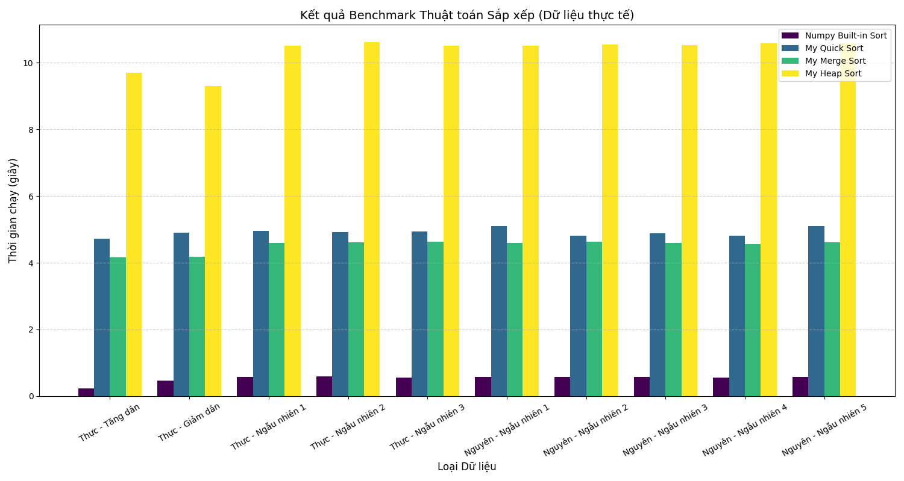

# BÁO CÁO KẾT QUẢ THỬ NGHIỆM THUẬT TOÁN SẮP XẾP

Dự án này thực hiện đo lường và so sánh hiệu năng của các thuật toán sắp xếp kinh điển được cài đặt bằng ngôn ngữ Python so với thư viện tối ưu hóa Numpy.

## 1. Thông tin chung
* **Sinh viên thực hiện**: Quảng Thành Nguyên Phúc
* **Lớp**: AI2025
* **Nội dung**: Thử nghiệm tốc độ thực thi trên 10 bộ dữ liệu số thực và số nguyên, mỗi bộ gồm 1.000.000 phần tử.

## 2. Kết quả thử nghiệm

### Bảng thời gian thực hiện (đơn vị: giây)
Dữ liệu thử nghiệm bao gồm các trạng thái: tăng dần (1), giảm dần (2) và ngẫu nhiên (3-10).

| Dữ liệu | Quick sort | Heap sort | Merge sort | Numpy Builtin sort |
| :---: | :---: | :---: | :---: | :---: |
| **1** | 4.72917 | 9.70047 | 4.16955 | 0.23729 |
| **2** | 4.89826 | 9.30027 | 4.18529 | 0.23729 |
| **3** | 4.96321 | 10.50984 | 4.59380 | 0.57605 |
| **4** | 4.91502 | 10.62064 | 4.61345 | 0.58622 |
| **5** | 4.93823 | 10.51570 | 4.63902 | 0.54939 |
| **6** | 5.10973 | 10.50627 | 4.60079 | 0.57368 |
| **7** | 4.81291 | 10.54462 | 4.62870 | 0.57829 |
| **8** | 4.88540 | 10.53531 | 4.59427 | 0.56627 |
| **9** | 4.80443 | 10.57843 | 4.55779 | 0.56392 |
| **10** | 5.10896 | 10.58359 | 4.62118 | 0.56941 |
| **Trung bình** | **4.91653** | **10.33951** | **4.52038** | **0.50378** |

*(Dữ liệu được trích xuất từ kết quả thực nghiệm thực tế)*

### Biểu đồ thời gian thực hiện

*(Hình ảnh minh họa so sánh thời gian thực hiện giữa các thuật toán)*

## 3. Kết luận
Dựa trên kết quả thực nghiệm thu được, dự án rút ra các kết luận sau:
* **Numpy Builtin sort**: Cho tốc độ vượt trội nhất với thời gian trung bình khoảng 0.50378 giây, nhanh gấp nhiều lần so với các thuật toán tự cài đặt.
* **Merge sort**: Là thuật toán có hiệu năng tốt nhất và ổn định nhất trong nhóm tự cài đặt với thời gian trung bình khoảng 4.52 giây.
* **Quick sort**: Nhờ cải tiến chọn Pivot ngẫu nhiên, thuật toán duy trì được tốc độ trung bình khoảng 4.91 giây và không bị suy biến khi gặp các dãy số có thứ tự.
* **Heap sort**: Có thời gian thực hiện lâu nhất, trung bình khoảng 10.33 giây, do chi phí truy cập bộ nhớ và duy trì cấu trúc heap cao hơn.

## 4. Thông tin chi tiết
Repository này bao gồm các thành phần sau:
* **Báo cáo**: Chi tiết quá trình thử nghiệm và phân tích (file README.md).
* **Mã nguồn**: Toàn bộ code Python thực thi các thuật toán.
* **Dữ liệu thử nghiệm**: Script tạo bộ dữ liệu 1 triệu phần tử.
